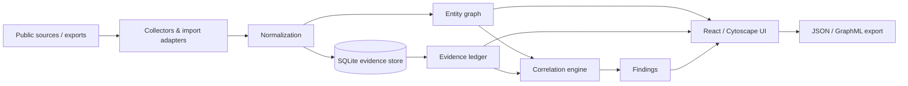

# Architecture

VIGIL is a local-first investigation workbench. It separates collection, normalization, correlation and analysis so a provider can be swapped without changing the case model.

## Components

### Web

`apps/web` is a React + Vite application. Cytoscape renders the entity-link graph and supports entity inspection without coupling the UI to any collection provider.

### API

`apps/api` is FastAPI. Its responsibilities are:

1. case lifecycle;
2. normalization of public observations;
3. passive domain collection;
4. evidence storage and hashing;
5. explainable correlation;
6. defensive coordinated-behavior detection;
7. export.

### Storage

SQLite is the default because an investigator can run VIGIL entirely on one workstation. The schema is intentionally relational and portable. A production multi-user deployment can replace the Store implementation with PostgreSQL without changing the API models.

## Core entities

- `account`: a public account observed on a platform;
- `domain`: a registered domain or external profile link;
- `hostname`: hostnames seen in public certificate data;
- `nameserver`: public registration infrastructure;
- `content_cluster`: normalized public content shared in a coordination cluster.

Every edge has:

- relation type;
- confidence;
- rationale;
- evidence IDs.

This is deliberate: graph visualization without provenance creates misleading certainty.

## Collection policy

Built-in network collection is passive and limited to public registries/archives. Public-account correlation consumes imported observations rather than automatically sweeping private individuals.

## Scaling path

For larger deployments:

- replace SQLite with PostgreSQL;
- add Redis/RQ or a queue for long-running collectors;
- object-store raw source captures;
- add STIX 2.1 / MISP exchange;
- add RBAC and per-case retention rules;
- add immutable evidence manifests and signed report bundles.
